# Análise Completa — Online Boutique Microservices

> **Projeto:** Google Microservices Demo (Online Boutique) — aplicação de e-commerce distribuída
> **Tecnologias:** Go · C# · Node.js · Python · Java · Kubernetes · Docker · gRPC · Redis
> **Objetivo:** Análise técnica completa para trabalho prático de Arquiteturas Distribuídas

---

## Índice

1. [Arquitetura dos Microserviços](#1--arquitetura-dos-microserviços)
2. [Operações Externas e Endpoints](#2--operações-externas-e-endpoints)
3. [Manifestos Kubernetes](#3--manifestos-kubernetes)
4. [Diagramas de Sequência](#4--diagramas-de-sequência)
5. [Dependências entre Serviços](#5--dependências-entre-serviços)
6. [Deployment para Múltiplos Utilizadores](#6--deployment-para-múltiplos-utilizadores)
7. [Workload Crítico](#7--workload-crítico)
8. [Latência e Cenários Locust](#8--latência-e-cenários-locust)
9. [Aumento de Carga e Evolução da Latência](#9--aumento-de-carga-e-evolução-da-latência)

---

## 1 — Arquitetura dos Microserviços

O **Online Boutique** é uma aplicação de e-commerce composta por **12 microserviços**
(11 na configuração base + 1 opcional para Google Cloud),
cada um desenvolvido numa linguagem diferente e com uma responsabilidade única.
Esta abordagem — conhecida como arquitetura de microserviços — permite que cada componente seja desenvolvido,
testado, escalado e atualizado de forma independente, sem afetar os restantes.

A comunicação interna entre serviços é feita exclusivamente via **gRPC**, um protocolo de chamada
remota de procedimentos (RPC) baseado em HTTP/2, que é mais eficiente do que REST para comunicação
intra-serviço. O único ponto de entrada externo é o **frontend**, que expõe uma API HTTP normal
para o browser do utilizador.

O diagrama mostra os fluxos de comunicação: o utilizador acede ao *frontend*, que por sua vez
consulta os outros serviços consoante a operação pedida. O *loadgenerator* simula utilizadores reais
automaticamente para efeitos de teste.

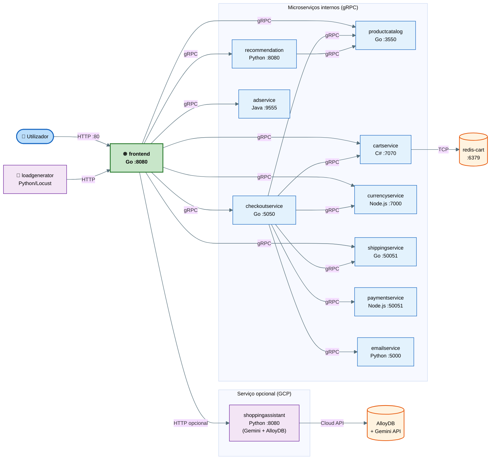

> **Porquê gRPC e não REST?** O gRPC usa Protobuf (binary serialization) em vez de JSON, o que
> é até 10x mais rápido em parsing. Além disso, usa HTTP/2 que permite multiplexar várias chamadas na mesma
> conexão TCP, reduzindo latência. Em sistemas com muitas chamadas inter-serviço (como este), faz diferença significativa.

| Serviço | Linguagem | Porta | Responsabilidade principal |
|---|---|---|---|
| frontend | Go | 8080 | Servidor HTTP, renderiza as páginas, orquestra chamadas para os outros serviços |
| productcatalogservice | Go | 3550 | Lista e detalha produtos a partir de um ficheiro JSON estático |
| checkoutservice | Go | 5050 | Orquestra o processo de checkout: valida carrinho, cobra pagamento, envia email |
| shippingservice | Go | 50051 | Calcula custo de envio e confirma expedição (simulado) |
| cartservice | C# | 7070 | Gere o carrinho de compras persistido no Redis |
| currencyservice | Node.js | 7000 | Converte preços entre moedas usando taxas do Banco Central Europeu |
| paymentservice | Node.js | 50051 | Processa o pagamento com cartão de crédito (simulado) |
| emailservice | Python | 5000 *(container: 8080)* | Envia email de confirmação de encomenda (simulado) |
| recommendationservice | Python | 8080 | Sugere produtos relacionados com base no carrinho atual |
| adservice | Java | 9555 | Serve anúncios contextuais baseados nas palavras-chave da página |
| loadgenerator | Python | — | Simula utilizadores reais com Locust para testes de carga |
| shoppingassistantservice | Python | 8080 | Assistente de compras por IA com Google Gemini + AlloyDB (opcional, apenas GCP — sem manifesto K8s padrão) |
| redis-cart | — | 6379 | Base de dados em memória para armazenar os carrinhos de compras |

---

## 2 — Operações Externas e Endpoints

O **frontend** é o único serviço com endpoints HTTP acessíveis do exterior.
Todos os outros serviços são internos ao cluster e comunicam via gRPC.
Do ponto de vista do utilizador (ou do load generator), existem **8 endpoints HTTP**.

O **peso** na coluna da direita representa a frequência relativa com que o Locust executa
cada operação: um peso de 10 significa que *browseProduct* é executado 10 vezes mais do que
*checkout*. Isto reflete o comportamento real de utilizadores numa loja online:
a maioria navega, poucos compram.

Internamente, cada pedido HTTP que chega ao frontend gera uma ou mais chamadas gRPC para os serviços
responsáveis. Por exemplo, carregar a página de um produto (`/product/{id}`) desencadeia 5 chamadas
gRPC em paralelo: catálogo, moeda, recomendações, anúncios e carrinho.

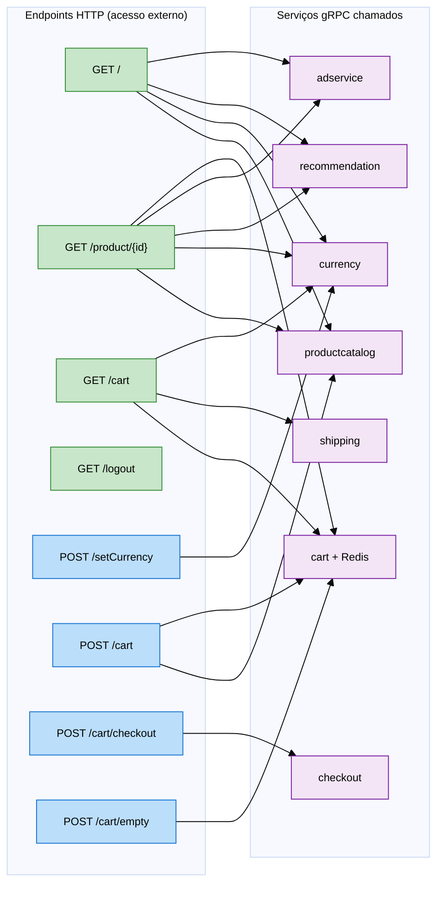

| Endpoint | Método | O que faz | Serviços gRPC chamados | Peso Locust |
|---|---|---|---|---|
| / | GET | Página inicial com produtos em destaque | productcatalog, currency, recommendation, ad | 1 |
| /product/{id} | GET | Página de detalhe de produto | productcatalog, currency, recommendation, ad, cart | **10** — mais chamado |
| /cart | GET | Ver o carrinho com preços de envio | cart, shipping, currency | 3 |
| /setCurrency | POST | Alterar a moeda de apresentação | currency | 2 |
| /cart | POST | Adicionar produto ao carrinho | productcatalog, cart | 2 |
| /cart/checkout | POST | Finalizar compra (orquestra 6 serviços) | checkout → cart, catalog, currency, shipping, payment, email | 1 |
| /cart/empty | POST | Esvaziar carrinho | cart | — |
| /logout | GET | Terminar sessão | nenhum | — |

---

## 3 — Manifestos Kubernetes

Um **manifesto Kubernetes** é um ficheiro YAML que descreve *o estado desejado* da aplicação.
Em vez de dizer "corre este container agora", dizes "quero que este serviço esteja sempre a correr com estas
configurações". O Kubernetes lê o ficheiro e trata de garantir esse estado — se um pod falhar, é recriado automaticamente.

Neste projeto existem **12 ficheiros YAML** em `kubernetes-manifests/` (11 manifestos de serviço + `kustomization.yaml`).
O ficheiro `release/kubernetes-manifests.yaml` é a junção de todos eles num único ficheiro.
Um único comando aplica tudo: `kubectl apply -f release/kubernetes-manifests.yaml`.

### 3a — O que acontece quando corres kubectl apply

O diagrama mostra o fluxo interno do Kubernetes desde o momento em que corres o comando até o pod
estar efetivamente a servir tráfego. O ponto importante é que o Kubernetes não inicia tráfego
para um pod enquanto o *readinessProbe* não passar — garante que o serviço está realmente pronto.

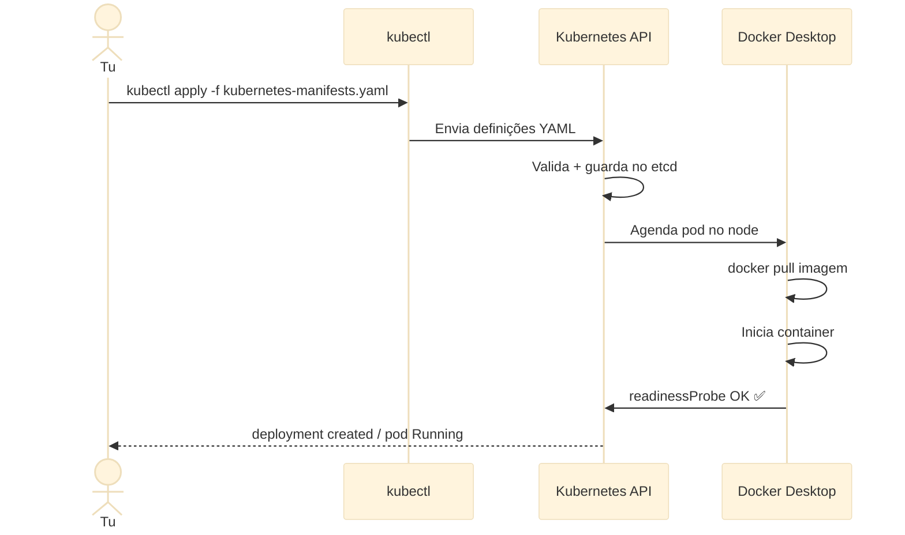

### 3b — Estrutura de um ficheiro YAML

Cada ficheiro tem **3 blocos separados por `---`**. O diagrama usa o
`checkoutservice.yaml` como exemplo. O bloco mais importante é o **Deployment**
— define a imagem Docker, as variáveis de ambiente (como o endereço dos outros serviços), os limites de
recursos e as health probes. O **Service** cria o nome DNS interno para que outros pods
encontrem este serviço. O **ServiceAccount** define a identidade de segurança.

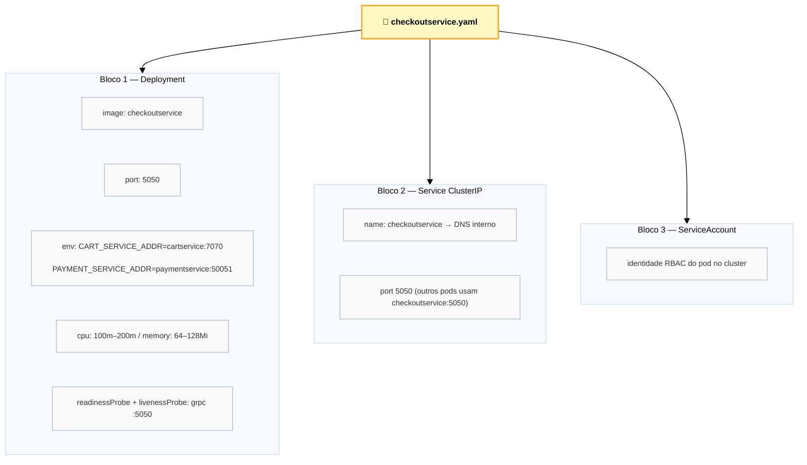

### 3c — Recursos criados por cada manifesto

A tabela mostra exactamente o que cada ficheiro YAML cria no cluster.
O **loadgenerator** não tem Service (não precisa de ser encontrado por outros pods).
O **cartservice.yaml** é especial porque inclui também o *redis-cart* — dois deployments num único ficheiro.

| Ficheiro YAML | Deployment | Service ClusterIP | Service LoadBalancer | ServiceAccount |
|---|---|---|---|---|
| frontend.yaml | ✅ | ✅ frontend:80 | ✅ **localhost:80** | ✅ |
| cartservice.yaml | ✅ + ✅ redis-cart | ✅ (ambos) | — | ✅ |
| checkoutservice.yaml | ✅ | ✅ :5050 | — | ✅ |
| productcatalogservice.yaml | ✅ | ✅ :3550 | — | ✅ |
| currencyservice.yaml | ✅ | ✅ :7000 | — | ✅ |
| paymentservice.yaml | ✅ | ✅ :50051 | — | ✅ |
| emailservice.yaml | ✅ | ✅ :5000 | — | ✅ |
| shippingservice.yaml | ✅ | ✅ :50051 | — | ✅ |
| recommendationservice.yaml | ✅ | ✅ :8080 | — | ✅ |
| adservice.yaml | ✅ | ✅ :9555 | — | ✅ |
| loadgenerator.yaml | ✅ | — | — | ✅ |

| Recurso | Função | Analogia |
|---|---|---|
| **Deployment** | Garante N réplicas sempre a correr. Recria pods que falham automaticamente. | "Supervisor" que reinicia processos mortos |
| **Service ClusterIP** | DNS interno estável (`cartservice:7070`). Faz load balance entre réplicas. | "Lista telefónica" interna do cluster |
| **Service LoadBalancer** | Expõe para fora do cluster. No Docker Desktop → `localhost:80`. | "Porta de entrada" pública da loja |
| **ServiceAccount** | Identidade do pod para controlo de acesso (RBAC). | "Cartão de identificação" do serviço |

---

## 4 — Diagramas de Sequência

Os diagramas de sequência mostram a ordem exacta das chamadas entre serviços para cada operação.
São úteis para perceber a **latência acumulada**: cada seta é um pedido de rede,
e o tempo total de resposta é a soma de todas as chamadas em série.
Chamadas que podem ser feitas em paralelo são representadas sem dependência entre si.

### 4a — Browse de um produto *(peso 10 — operação mais frequente)*

Esta é a operação mais chamada no sistema. Quando o utilizador abre a página de um produto, o frontend
faz **5 chamadas gRPC**: busca o produto, converte o preço, pede recomendações, pede anúncios
e verifica o carrinho. Algumas podem ser paralelas, mas nesta implementação são sequenciais —
o que aumenta a latência total.

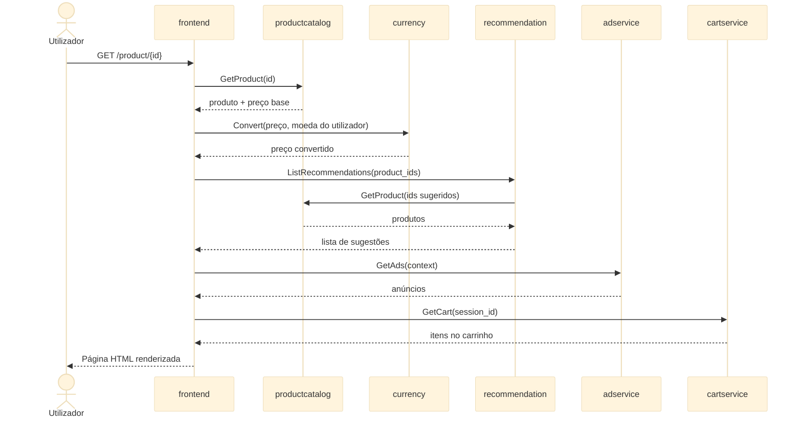

### 4b — Checkout *(operação mais complexa — 6 serviços em cadeia)*

O checkout é a operação mais complexa e com maior latência. O **checkoutservice** age
como orquestrador: chama os outros serviços em sequência, e o tempo total é a *soma de todas as latências*.
Se qualquer serviço ficar lento (ex: paymentservice), todo o checkout fica lento.
É por isso que o checkoutservice é um **ponto crítico de falha**.

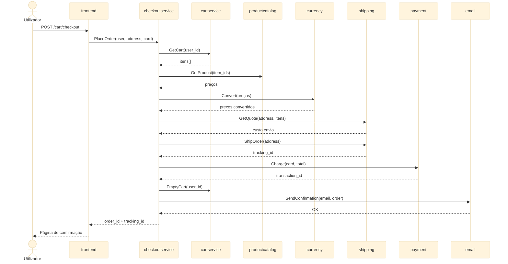

### 4c — Adicionar ao carrinho

Operação simples: o frontend valida que o produto existe, depois pede ao cartservice para o guardar.
O cartservice persiste no Redis com uma chave baseada no `session_id` do utilizador.
Como o Redis está em memória, esta operação é muito rápida (sub-milissegundo de escrita).

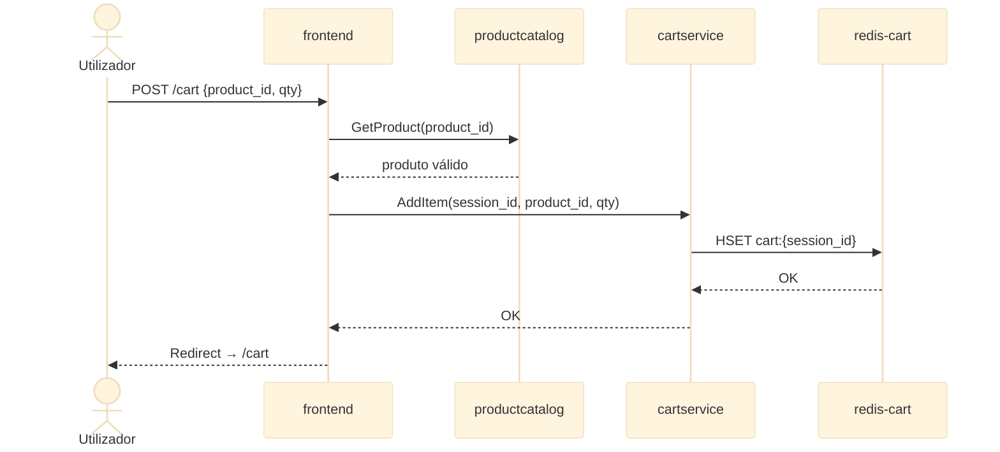

---

## 5 — Dependências entre Serviços

Conhecer as dependências é essencial para perceber o **impacto de uma falha**.
Se o *productcatalogservice* falhar, afeta o frontend, o checkoutservice e o recommendationservice
simultaneamente. Se o *redis-cart* falhar, o cartservice fica indisponível, o que bloqueia
checkouts e adições ao carrinho.

Os serviços sem dependências externas (folhas) são os mais resilientes: *paymentservice*,
*emailservice*, *adservice* e *shippingservice* são independentes e raramente
falham por causa de outro serviço. Já o **frontend** depende de 8 serviços — é o mais
vulnerável a falhas em cascata.

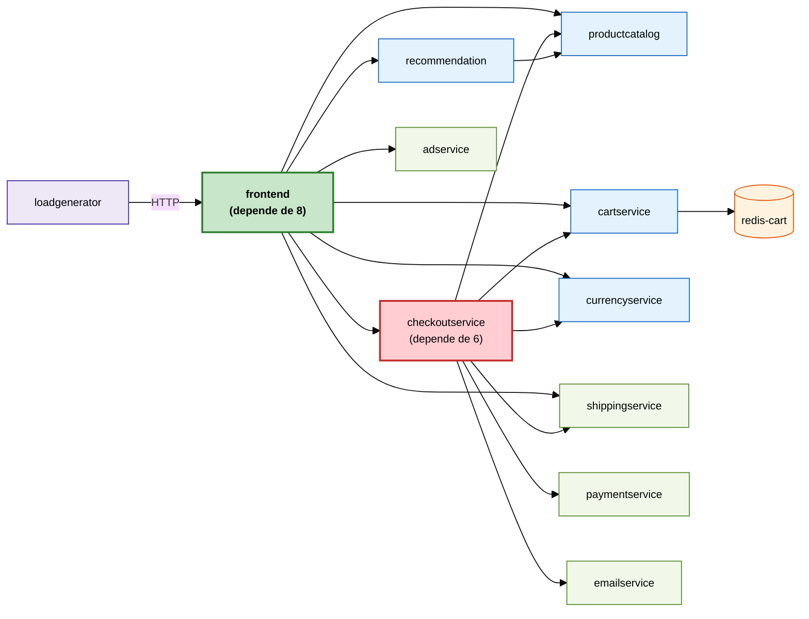

| Serviço | Depende de | Chamado por | Risco de falha |
|---|---|---|---|
| productcatalogservice | Nenhum | frontend, checkout, recommendation | 🔴 Alto — afeta 3 serviços |
| cartservice + Redis | redis-cart | frontend, checkout | 🔴 Alto — bloqueia compras |
| currencyservice | ECB API (externo) | frontend, checkout | 🟠 Médio |
| checkoutservice | 6 serviços | frontend | 🟠 Médio — ponto de orquestração |
| shippingservice | Nenhum | frontend, checkout | 🟢 Baixo |
| paymentservice | Nenhum | checkout | 🟢 Baixo |
| emailservice | Nenhum | checkout | 🟢 Baixo (não bloqueia checkout) |
| adservice | Nenhum | frontend | 🟢 Baixo (degradação suave) |
| shoppingassistantservice | AlloyDB + Gemini API (Google Cloud) | frontend (opcional) | 🟡 N/A — serviço opcional, apenas em GCP; não afeta o deployment base |

---

## 6 — Deployment para Múltiplos Utilizadores

Com Kubernetes, escalar para mais utilizadores é uma questão de **aumentar o número de réplicas**
de um serviço. O Kubernetes distribui automaticamente o tráfego entre as réplicas através do Service
(que funciona como load balancer interno).

Existem duas abordagens: **escalonamento manual** (defines tu o número de pods)
e **HPA — Horizontal Pod Autoscaler** (o Kubernetes decide automaticamente com base em métricas
como CPU ou memória). O HPA é mais adequado para cargas variáveis — por exemplo, mais tráfego durante o
dia e menos à noite.

A estratégia inteligente é escalar primeiro os serviços que são *bottleneck* (ver secção 7),
não todos ao mesmo tempo. Escalar o frontend não adianta se o productcatalogservice está saturado.

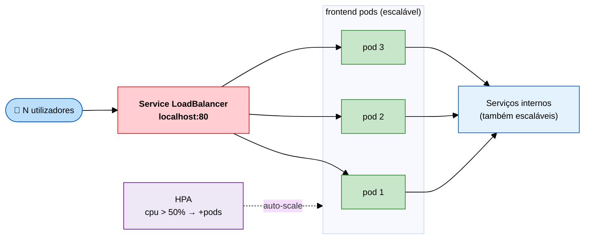

| Estratégia | Comando | Quando usar |
|---|---|---|
| Escalar réplicas manualmente | `kubectl scale deployment frontend --replicas=3` | Sabes antecipadamente a carga esperada |
| HPA automático por CPU | `kubectl autoscale deployment frontend --cpu-percent=50 --min=1 --max=5` | Carga variável e imprevisível |
| Escalar serviço crítico | `kubectl scale deployment productcatalogservice --replicas=3` | Quando identificas o bottleneck (secção 7) |
| Aumentar limites de recursos | Editar o YAML: `cpu.limits: 500m` | Pod usa CPU máxima mas não há mais pods a lançar |

---

## 7 — Workload Crítico

Para perceber o que é mais crítico, analisa-se a combinação de dois fatores:
a **frequência** com que cada operação é chamada (pesos do Locust) e o
**número de serviços** que cada operação envolve.

O *browseProduct* tem peso 10 — é executado 10 vezes mais do que o checkout.
Como envolve 5 serviços (productcatalog, currency, recommendation, adservice, cart),
estes são os serviços sob maior pressão contínua.
O *productcatalogservice* é chamado em quase todas as operações e não tem cache —
**é o maior bottleneck potencial**.

O checkout, apesar de complexo, é pouco frequente. O redis-cart é crítico porque é
single-threaded: com muita carga simultânea de carrinho, as operações ficam em fila.

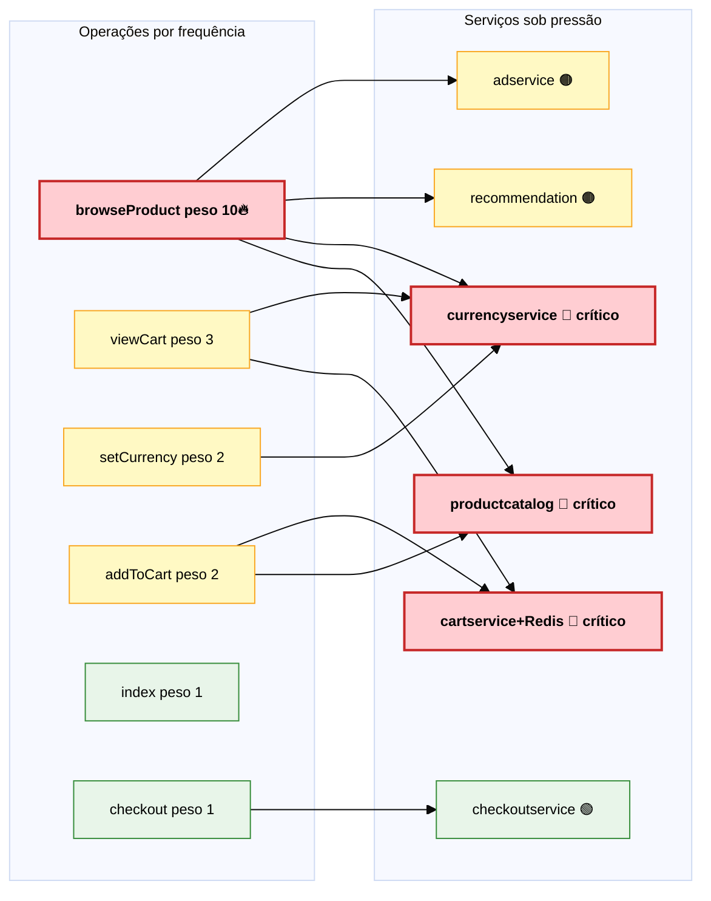

> **Bottlenecks por ordem de prioridade:**
> 1. **productcatalogservice** — chamado em browse (×10), addToCart (×2), index, checkout. Sem cache. Escalar primeiro.
> 2. **currencyservice** — chamado em browse, viewCart, checkout. Faz chamada HTTP externa ao BCE em cada pedido.
> 3. **cartservice + redis-cart** — Redis é single-threaded. Com 100+ users simultâneos, as operações ficam em fila.
> 4. **checkoutservice** — Chama 6 serviços em sequência. Latência total = soma das latências individuais.

---

## 8 — Latência e Cenários Locust

O **Locust** é a ferramenta de load testing já incluída no projeto (pasta `src/loadgenerator`).
Simula utilizadores reais que navegam, adicionam ao carrinho e fazem checkout, com tempos de espera
aleatórios entre operações (1 a 10 segundos), tal como um utilizador real faria.

O ficheiro `locustfile.py` define o comportamento: a classe `WebsiteUser` tem uma
lista de tarefas com pesos. O Locust escolhe aleatoriamente a próxima tarefa com base no peso —
*browseProduct* (peso 10) é escolhido 10 vezes mais do que *checkout* (peso 1).

As métricas mais importantes a observar são:
**p50** (mediana — metade dos pedidos é mais rápido que este valor),
**p90** (90% dos pedidos é mais rápido),
**p99** (99% dos pedidos é mais rápido — revela os casos extremos).
Em sistemas de produção, normalmente define-se um SLA como "p99 < 500ms".

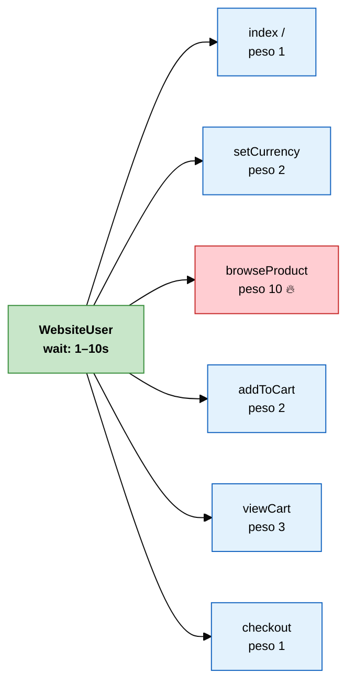

### Como correr testes de latência

**Opção A — Interface gráfica (recomendado para explorar):**

```bash
pip install locust faker
cd src/loadgenerator
locust --host=http://localhost --web-port=8089
# Abre http://localhost:8089
# Define: Number of users = 50, Spawn rate = 5/s → Start
# Vês em tempo real: req/s, p50, p90, p99, erros
```

**Opção B — Terminal, sem interface (para exportar dados CSV):**

```bash
locust --host=http://localhost \
       --users=50 --spawn-rate=5 \
       --run-time=3m --headless \
       --csv=resultados
# Gera: resultados_stats.csv  com p50, p90, p95, p99, max por endpoint
# Gera: resultados_failures.csv com erros
```

**Opção C — k6 (mais simples, sem instalar Locust):**

```bash
brew install k6
k6 run --vus 50 --duration 60s - <<EOF
import http from 'k6/http';
import { sleep } from 'k6';
export default function() {
  http.get('http://localhost/');
  http.get('http://localhost/product/OLJCESPC7Z');
  sleep(Math.random() * 3);
}
EOF
# Output: p50, p90, p95, p99 diretamente no terminal
```

---

## 9 — Aumento de Carga e Evolução da Latência

A estratégia correta para load testing é **progressiva**: começas com poucos utilizadores
para estabelecer a baseline e vais aumentando, observando como a latência evolui.
O objetivo não é "rebentar" o sistema, mas *encontrar o ponto onde a degradação começa*
e perceber qual o serviço responsável.

Em sistemas de microserviços, a degradação raramente acontece de forma uniforme — normalmente
um serviço específico satura primeiro (o bottleneck) e arrasta os outros. Com Kubernetes,
a resposta é escalar esse serviço específico em vez de escalar tudo.

```mermaid
%%{init:{'theme':'base','themeVariables':{'fontSize':'12px'}}}%%
flowchart LR
    classDef fase fill:#E3F2FD,stroke:#1565C0,stroke-width:2px,color:#000,font-weight:bold
    classDef ok   fill:#C8E6C9,stroke:#388E3C,color:#000
    classDef warn fill:#FFF9C4,stroke:#F9A825,color:#000
    classDef crit fill:#FFCDD2,stroke:#C62828,color:#000

    F1["Fase 1\n5 users\nBaseline"]:::fase
    F2["Fase 2\n25 users"]:::fase
    F3["Fase 3\n100 users"]:::fase
    F4["Fase 4\n250 users\nStress"]:::fase

    R1["✅ p99 < 200ms\nSistema estável"]:::ok
    R2["⚠️ p99 ~400ms\nProductCatalog lento"]:::warn
    R3["⚠️ p99 ~1–2s\nRedis em fila"]:::warn
    R4["❌ Timeouts\nCheckout a falhar"]:::crit

    F1 --> R1 --> F2
    F2 --> R2 --> F3
    F3 --> R3 --> F4
    F4 --> R4
```

Em cada fase, o objetivo é registar os valores de p50, p90 e p99 para cada endpoint.
Quando o p99 de um endpoint começa a subir de forma desproporcionada, encontraste o bottleneck.
A tabela abaixo guia o que observar em cada fase e como reagir.

| Fase | Utilizadores | Duração | O que observar | Ação recomendada |
|---|---|---|---|---|
| **Baseline** | 5 | 2 min | Latência base de cada endpoint — sem carga real | Anotar valores de referência (p50, p99) |
| **Normal** | 25 | 5 min | Como evoluem p50 e p99? Algum endpoint cresce mais? | Comparar com baseline. Identificar desvios. |
| **Alto** | 100 | 5 min | Qual serviço degrada primeiro? Ver `kubectl top pods` | Escalar o serviço que usa mais CPU: `kubectl scale deployment X --replicas=3` |
| **Stress** | 250 | 5 min | Erros 5xx, pod restarts, timeouts no checkout | HPA ou aumentar limites de CPU/RAM nos YAMLs |
| **Spike** | 0→500 em 30s | 3 min | Quanto tempo leva o sistema a recuperar? | Avaliar HPA response time e ajustar `--stabilization-window` |

### Comandos para monitorizar em paralelo durante os testes

```bash
# Terminal 1 — CPU e RAM de todos os pods em tempo real
kubectl top pods --sort-by=cpu

# Terminal 2 — Eventos do cluster (restarts, erros, OOM)
kubectl get events --sort-by=.lastTimestamp -w

# Terminal 3 — Logs do serviço que estás a investigar
kubectl logs -l app=productcatalogservice -f --tail=50

# Terminal 4 — Grafana com métricas Prometheus
kubectl port-forward svc/monitoring-grafana 3000:80
# Abre http://localhost:3000  (admin / admin)
# Dashboard: Kubernetes / Compute Resources / Pod
```

> **Para activar `kubectl top pods`**, instala o metrics-server:
> `kubectl apply -f https://github.com/kubernetes-sigs/metrics-server/releases/latest/download/components.yaml`
> Depois aguarda ~1 minuto e os dados começam a aparecer.

---

*Análise gerada para trabalho prático — Arquiteturas de Sistemas de Informação Distribuídos · 2026*
