# Gráficos ASID 2025/2026 — Mermaid

> Copiar cada bloco para https://mermaid.live → exportar PNG ou SVG → incluir no relatório.

---

## Gráfico 1 — Throughput vs. Carga (C1, C2, C3, C4)

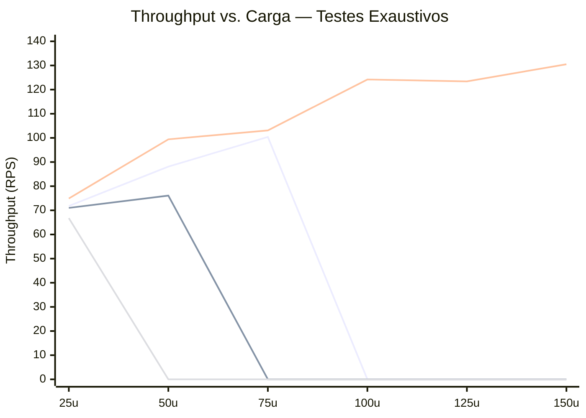

> **Legenda (por ordem):** C1 (quebra a 75u) · C2 (quebra a 50u) · C3 (aguentou até 150u) · C4 (quebra a 25u — pior)
> Os zeros após a quebra indicam fim de execução — não zero RPS.

---

## Gráfico 2 — Latência p99 vs. Carga

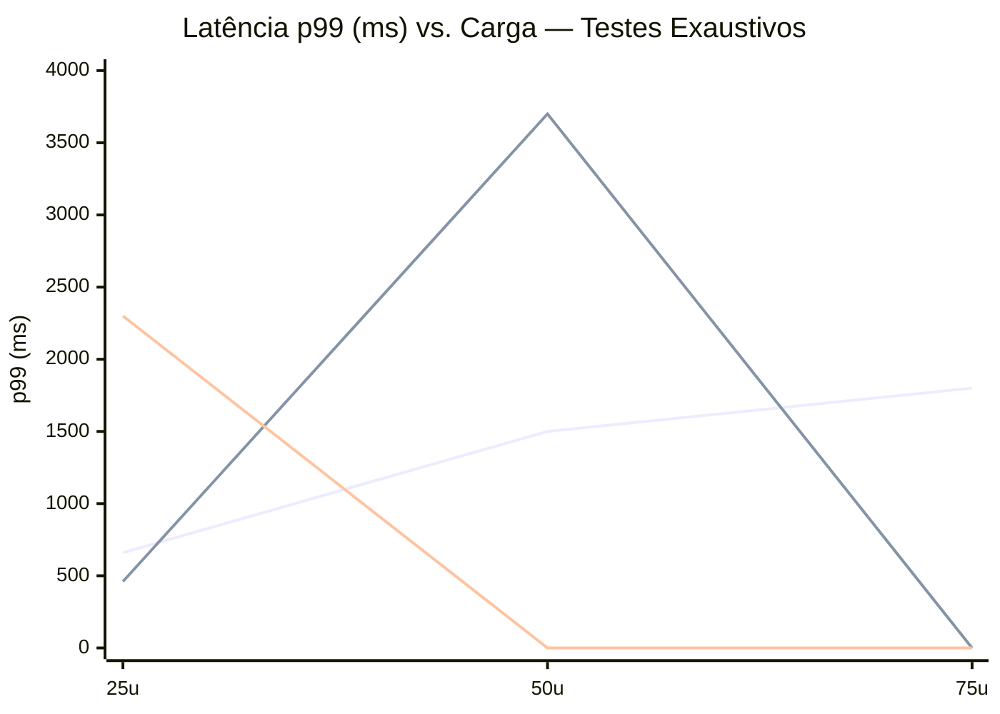

> **Legenda:** C1 · C2 (p99=3700ms a 50u, ultrapassa critério de 2000ms) · C4 (p99=2300ms já a 25u)
> Linha de referência critério de quebra: **2000 ms**

---

## Gráfico 3 — Ponto de Saturação por Cenário

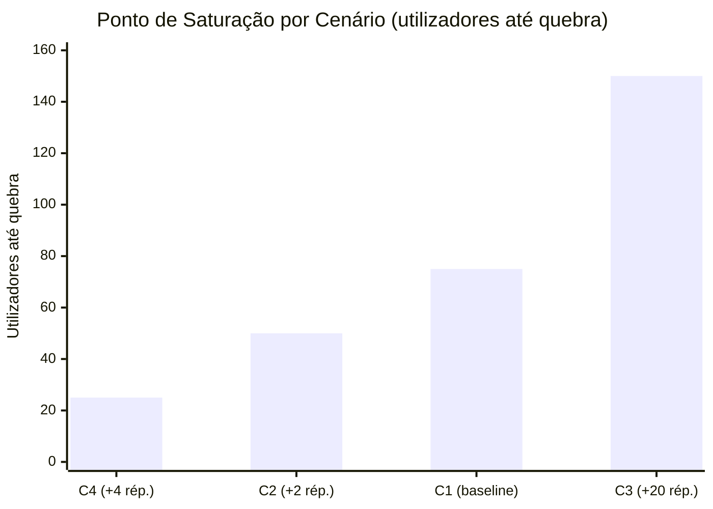

> C4 é o pior (25u), C2 pior que o baseline (50u < 75u), C3 o melhor (~150u).

---

## Gráfico 4 — Custo Proxy por Pedido — Testes Exaustivos

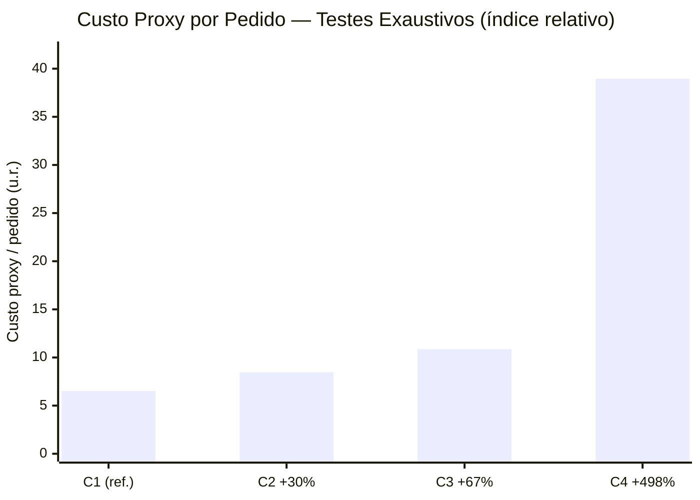

> C4 tem custo 6× superior ao C2 e ~40× superior ao C1 — 77,1% de falhas colapsam o denominador.

---

## Gráfico 5 — Distribuição de CPU entre Réplicas (C2 — connection affinity H6)

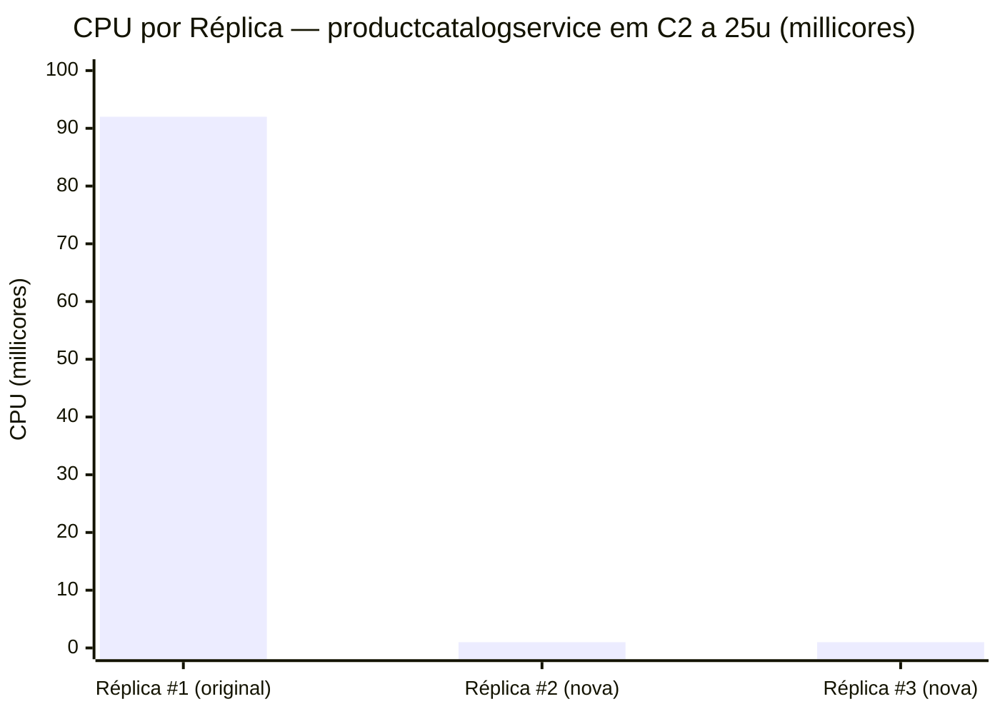

> Réplica original absorve 97,9% do tráfego. As novas réplicas ficam quase inativas — evidência de connection affinity gRPC/HTTP2 (H6).

---

## Gráfico 6 — CPU por Serviço no Ponto de Saturação — C1 (75u, baseline)

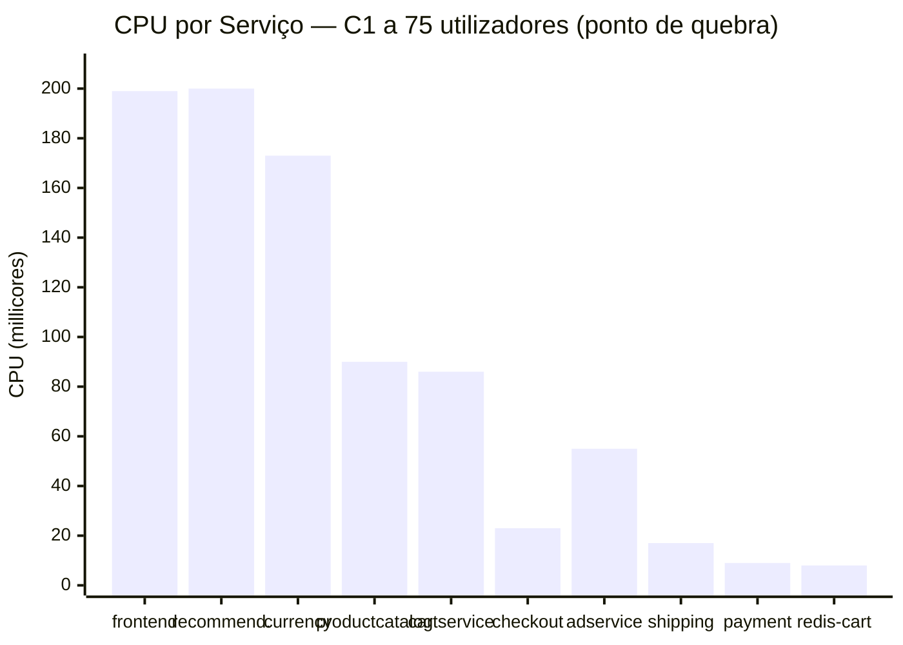

> frontend, recommendationservice e currencyservice são os mais pressionados. productcatalogservice (90m) é muito chamado mas rápido.

---

## Gráfico 7 — CPU por Serviço — C2 a 50u (ponto de quebra)

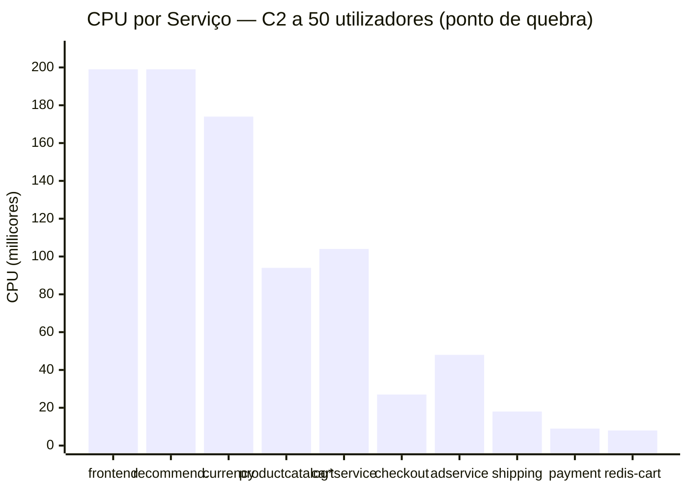

> *productcatalog total = 92m (#1) + 1m (#2) + 1m (#3). O escalamento não ajudou — os bottlenecks reais são frontend/currencyservice.

---

## Gráfico 8 — CPU por Serviço — C3 a 150u (total por serviço, 3 réplicas)

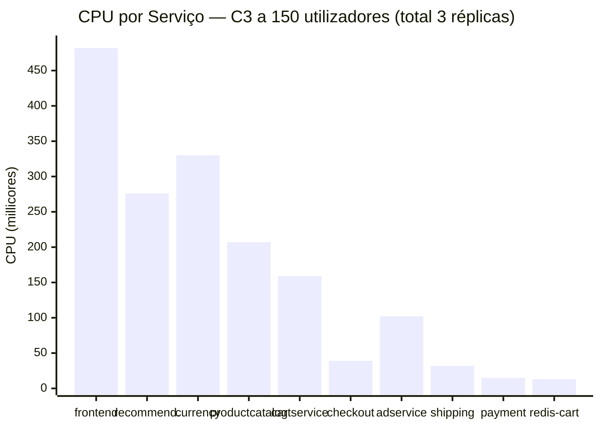

> Escalamento uniforme distribui a carga. redis-cart permanece baixo (13m) mesmo a 150u.

---

## Gráfico 9 — CPU por Serviço — C4 a 25u (ponto de quebra)

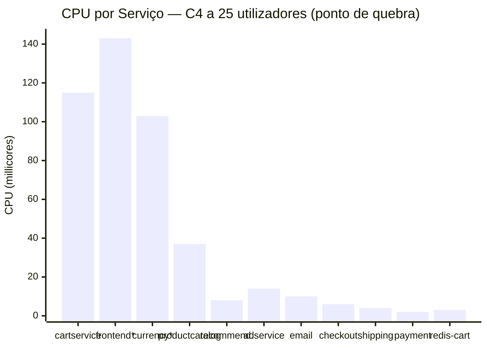

> *frontend e currencyservice foram escalados para ×3 (totais: 143m e 103m).
> cartservice (115m, 1 réplica) torna-se o novo bottleneck — efeito cascata.

---

## Gráfico 10 — Comparação Custo Marginal de Throughput (CMₜₕ)

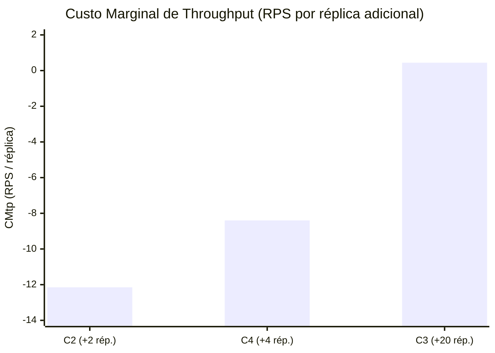

> C2 e C4 têm CMₜₕ negativo — cada réplica adicional reduziu o throughput. C3 é o único com CMₜₕ positivo.

---

## Gráfico 11 — Latência p50 Comparativo (15/20/25 users)

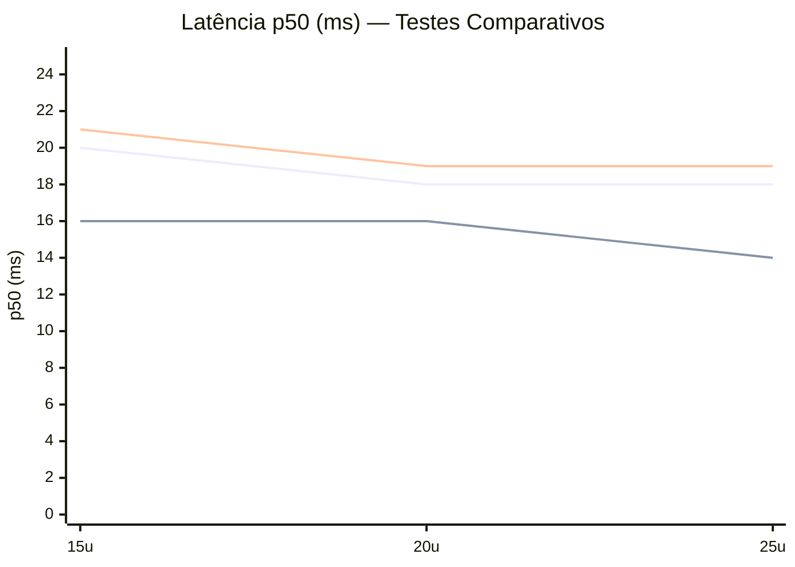

> **Legenda:** C1 · C2 · C3
> C2 tem melhor mediana a 25u (14ms, −22% face ao C1) — efeito das novas conexões a réplicas com menos carga.

---

## Gráfico 12 — Speedup Real vs. Teórico (Lei de Amdahl, s=0.654)

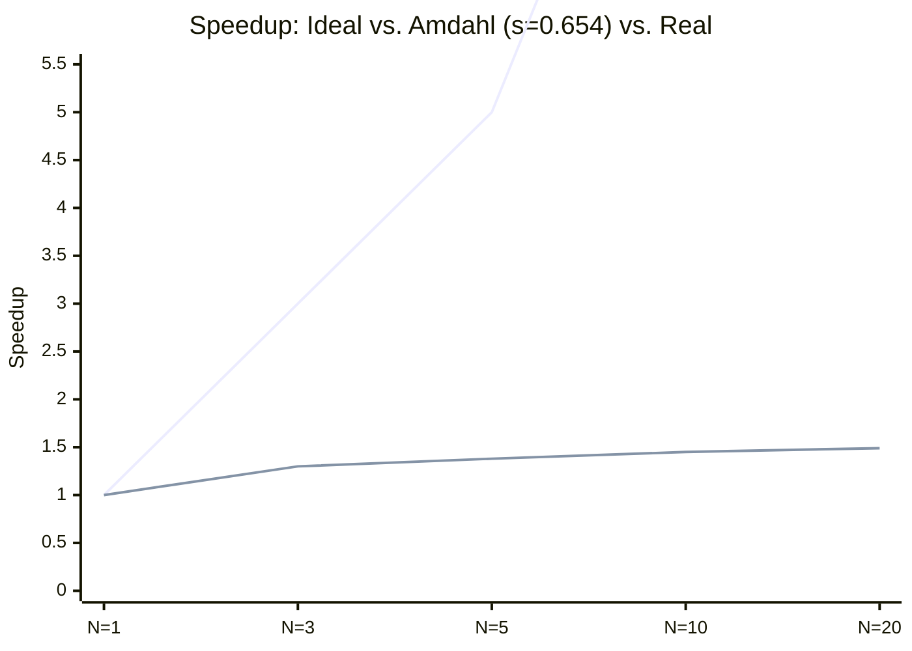

> **Legenda:** Ideal (s=0) · Com s=0,654 (fração serial efetiva observada)
> O speedup real com N=3 réplicas foi 1,30× — idêntico ao previsto por Amdahl com s=0,654.

---

## Notas de exportação

Para exportar cada gráfico:
1. Ir a **https://mermaid.live**
2. Colar o bloco de código (sem as ``` )
3. Clicar em **Actions → Download PNG** (ou SVG para qualidade vetorial)
4. Renomear o ficheiro e inserir no relatório LaTeX com `\includegraphics`

**Alternativa:** Notion, Obsidian e GitHub renderizam Mermaid nativamente — copiar o bloco completo incluindo as ```.
